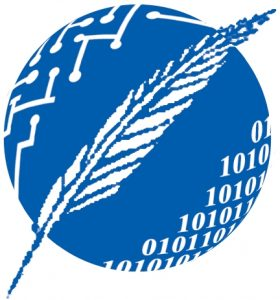

(setq markdown-css-paths '("repoassets/style.css"))
# Aulas Sustentables

Proyecto final de carrera, Ingenieria en Computación, Departamento de Ciencias e Ingenieria de la Computacion, **Universidad Nacional del Sur**.

### Integrantes
* Fassi Jeremias
* Salazar Gisbert Gabriel

### Funcionalidad
* TODO

### Fuentes y Agradecimientos
* TODO

 
 

     
   
   

